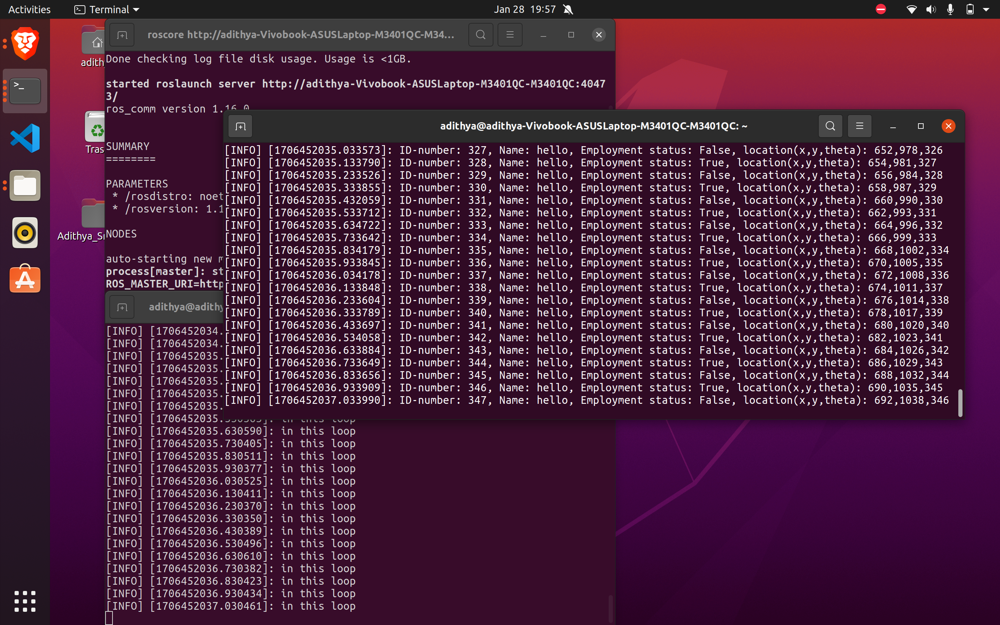

task-1:
* Creating a catkin workspace  
```
    mkdir -p catkin_ws/src  
    cd catkin_ws  
    catkin_make  

    source devel/setup.bash  
```  

* Creating a ROS package  
```
    cd catkin_ws/src  
    catkin_create_pkg robot_pkg std_msgs rospy roscpp  

    cd catkin_ws
    catkin_make

    source devel/setup.bash
```  

* Running turtlesim  
```
    roscore  
    rosrun turtlesim turtlesim_node  
    rosrun turtlesim turtle_teleop_key
```  
**Turtle-bot with teleop key**  


task-2:custom msg-

**Talker-Listener-python**  



**Talker-Listener-python**  


