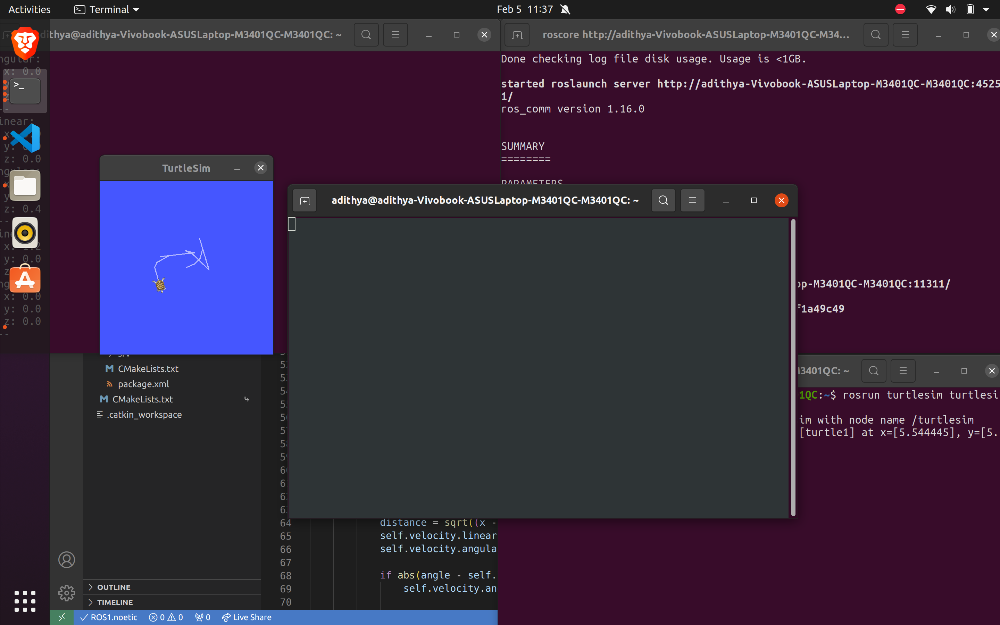
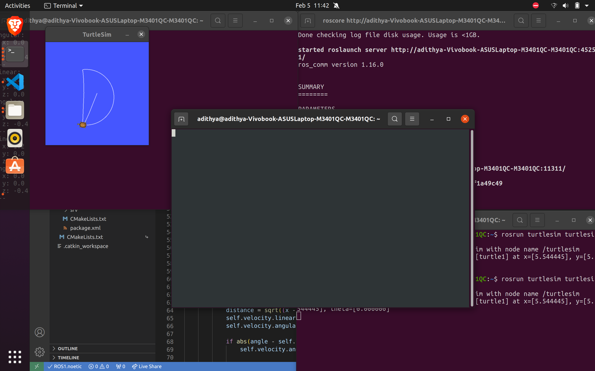
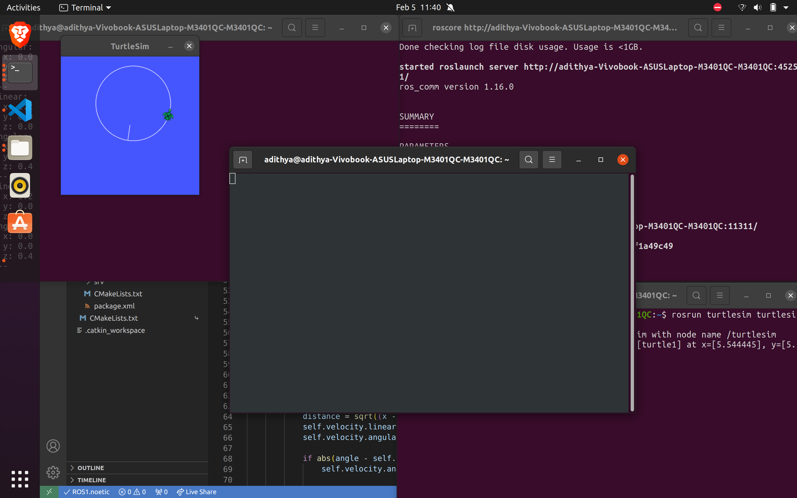
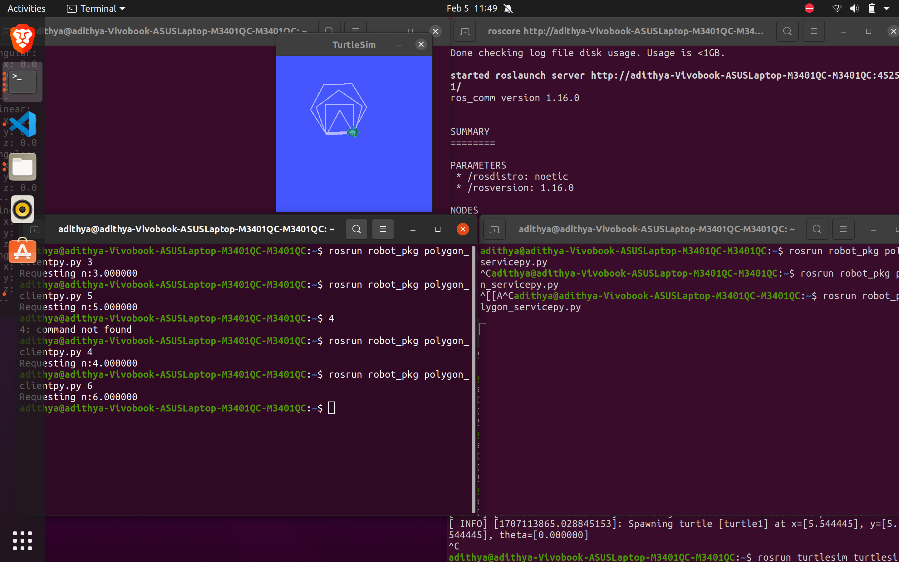

week-8:

	turtlebot - move, draw_D, draw_circle, client-server to draw any sided polygon
	
	turtlebot move:
	
	
	turtlebot draw_D:
	
	
	turtlebot draw_circle:
	
	
	client-server to draw any sided polygon:
	
	
